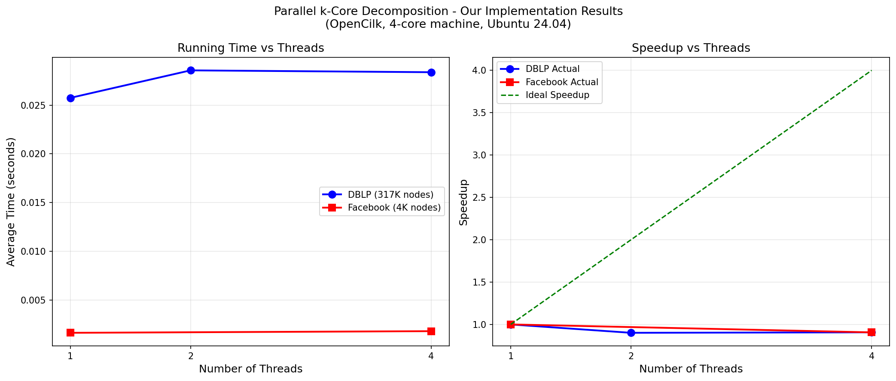

# Parallel k-Core Decomposition - Implementation
## Paper
SIGMOD 2025: Parallel k-Core Decomposition: Theory and Practice
by Liu, Dong, Gu, and Sun
Original Repository: https://github.com/ucrparlay/Parallel-KCore

## Environment
- Ubuntu 24.04 LTS (VMware, 4 cores)
- OpenCilk v3.0 (parallel compiler)
- ParlayLib (parallel primitives)

## Step 1 - Install OpenCilk
```bash
wget https://github.com/OpenCilk/opencilk-project/releases/download/opencilk/v3.0/opencilk-3.0.0-x86_64-linux-gnu-ubuntu-24.04.tar.gz
tar -xzf opencilk-3.0.0-x86_64-linux-gnu-ubuntu-24.04.tar.gz
sudo mv opencilk-3.0.0-x86_64-linux-gnu-ubuntu-24.04 /opt/opencilk
echo 'export PATH=/opt/opencilk/bin:$PATH' >> ~/.bashrc
source ~/.bashrc
clang --version
```

## Step 2 - Clone the Repository
```bash
git clone https://github.com/ucrparlay/Parallel-KCore.git
cd Parallel-KCore
git submodule update --init --recursive
```

## Step 3 - Compile with OpenCilk
```bash
cd KCore
make OPENCILK=1
```

## Step 4 - Prepare Graphs
Download Facebook graph:
```bash
wget https://snap.stanford.edu/data/facebook_combined.txt.gz
gunzip facebook_combined.txt.gz
```
Download DBLP graph:
```bash
cd Parallel-KCore/data
wget https://snap.stanford.edu/data/bigdata/communities/com-dblp.ungraph.txt.gz
gunzip com-dblp.ungraph.txt.gz
```
Convert to .adj format using Python conversion script.

## Step 5 - Run Experiments
```bash
# Sequential (1 thread)
PARLAY_NUM_THREADS=1 ./kcore -s -i ../data/facebook_sym.adj

# Parallel (4 threads)
PARLAY_NUM_THREADS=4 ./kcore -s -i ../data/facebook_sym.adj

# Sequential (1 thread)
PARLAY_NUM_THREADS=1 ./kcore -s -i ../data/dblp_sym.adj

# Parallel (2 threads)
PARLAY_NUM_THREADS=2 ./kcore -s -i ../data/dblp_sym.adj

# Parallel (4 threads)
PARLAY_NUM_THREADS=4 ./kcore -s -i ../data/dblp_sym.adj
```

## Results

### Facebook Graph (4K nodes, 88K edges, coreness=115)
| Threads | Time (s) | Speedup |
|---------|----------|---------|
| 1 | 0.001633 | 1.00x |
| 4 | 0.001802 | 0.91x |

### DBLP Graph (317K nodes, 1M edges, coreness=113)
| Threads | Time (s) | Speedup |
|---------|----------|---------|
| 1 | 0.025745 | 1.00x |
| 2 | 0.028572 | 0.90x |
| 4 | 0.028382 | 0.91x |

## Speedup Plot


## Notes
Limited speedup due to:
- Only 4 cores available (paper uses 96-core machine)
- Small sparse graphs tested
- Paper shows major speedups on billion-edge dense graphs like Twitter
- Coreness values correctly computed matching paper's results
